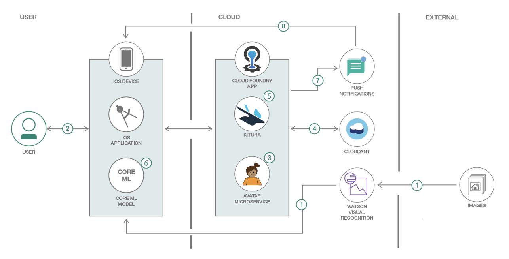
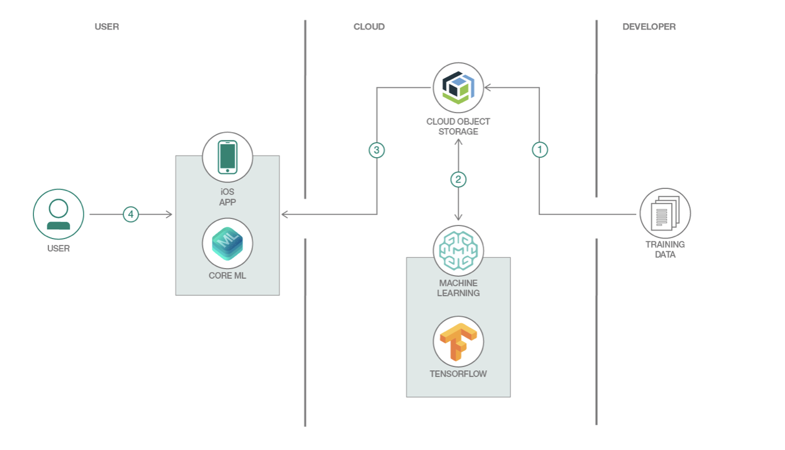

# ALT-CONF-2019

##  <a href="https://callforcode.org/challenge/">Call for Code 2019/a>

BUILD THE BEST TECHNOLOGY SOLUTION TO IMPROVE NATURAL DISASTER PREPAREDNESS, RESPONSE, AND RECOVERY
Competition ends on July 29, 2019

## <a href="https://developer.ibm.com/patterns/build-an-ios-game-powered-by-core-ml-and-watson-visual-recognition/">Build an iOS game powered by Core ML and Watson Visual Recognition</a>

Use Watson Visual Recognition and Core ML to create a Kitura-based iOS game 
that has a  user search for a predetermined list of objects

https://developer.apple.com/documentation/coreml/getting_a_core_ml_model

## <a href="https://developer.ibm.com/patterns/create-a-real-time-object-detection-app-using-watson-machine-learning/">Create a real-time object detection app using Watson Machine Learning</a>

Train your own custom model without substantive computing power and time.Create a real-time object detection app using Watson Machine Learning

## <a href="https://developer.ibm.com/patterns/create-a-real-time-object-detection-app-using-watson-machine-learning/">Building a FoodTracker Backend with Kitura</a>

https://github.com/IBM/FoodTrackerBackend

This tutorial teaches how to create a Kitura Swift backend for the FoodTracker iOS app tutorial from Apple. This project contains a version of the tutorial code that has been updated to use Codable rather than NSCoder.

Kitura.  https://cloud.ibm.com/catalog/starters/runtime-for-swift

[Build an Augmented Reality avatar for the iPhone- Live Tech Talk](https://developer.ibm.com/videos/build-an-ar-avatar-for-the-iphone-live-tech-talk/)

https://developer.ibm.com/patterns/create-a-real-time-object-detection-app-using-watson-machine-learning/
